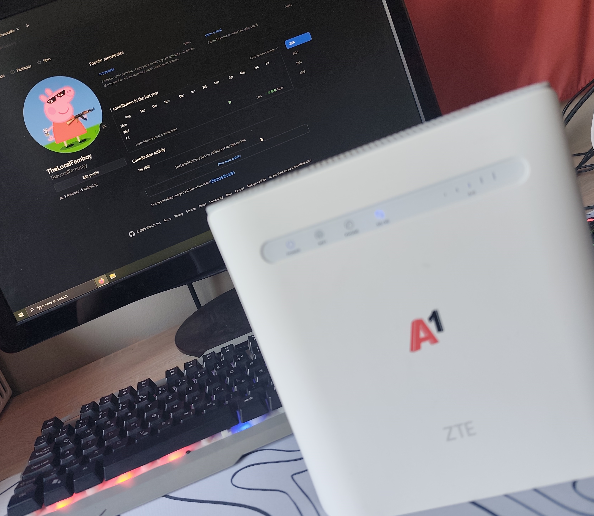
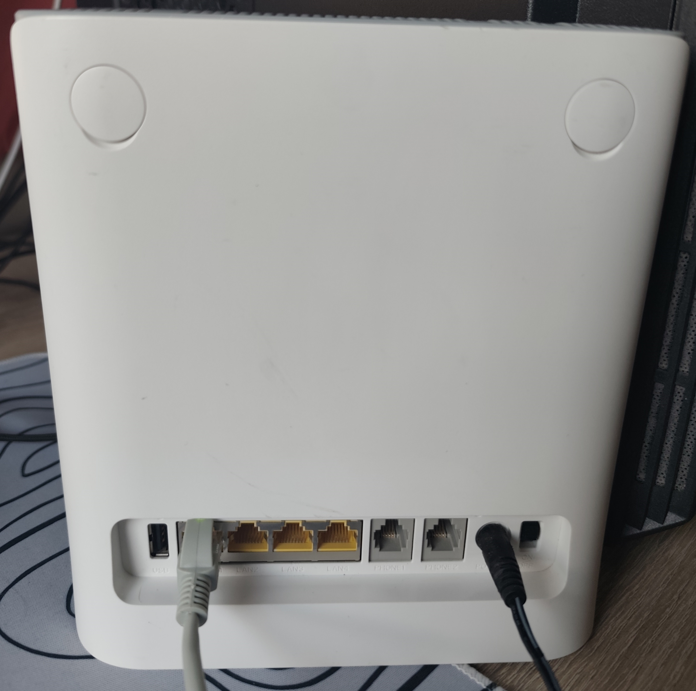
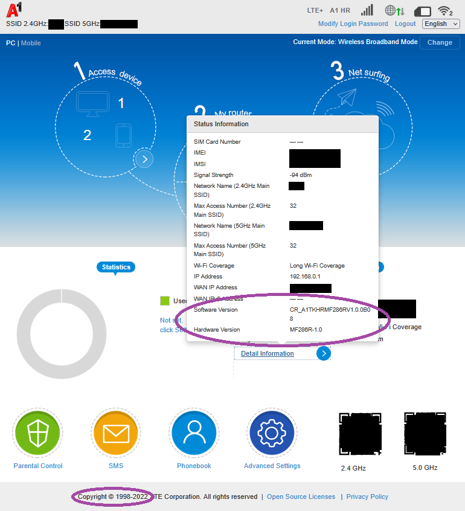
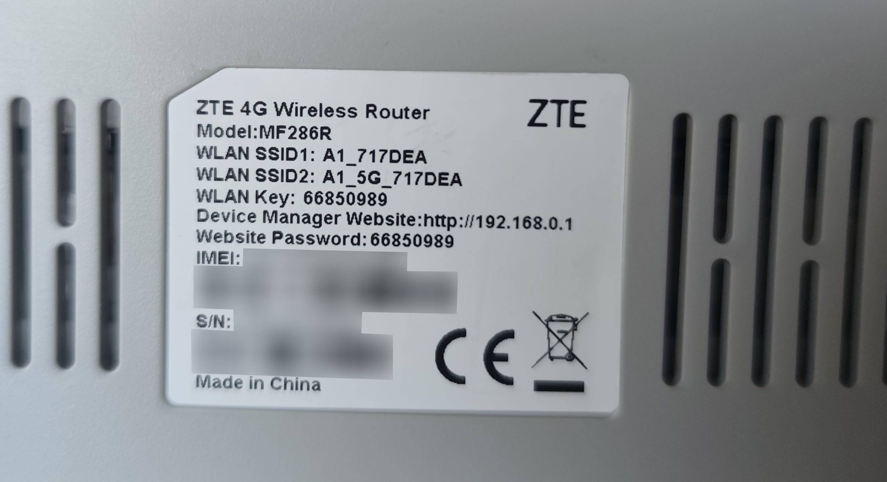
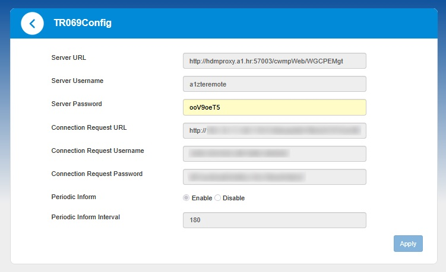
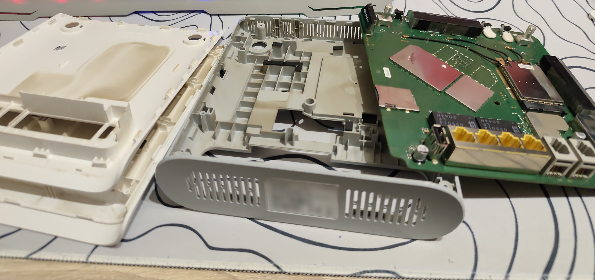
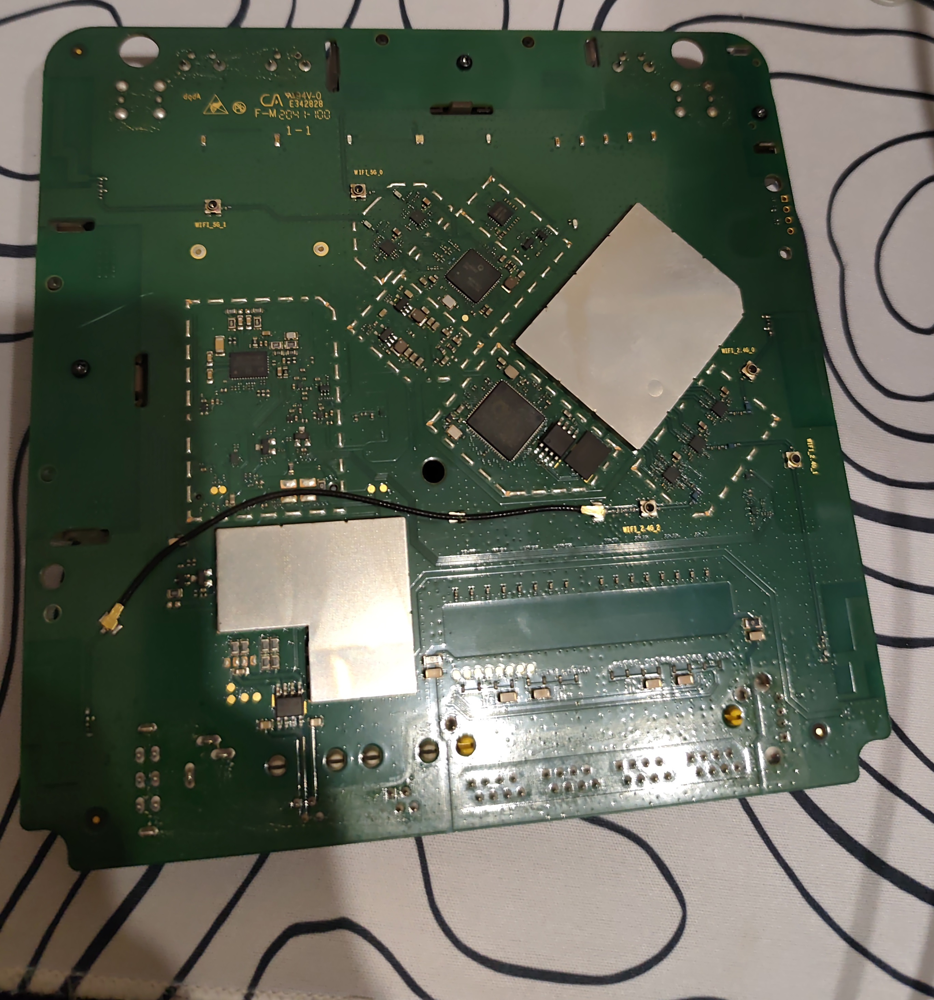
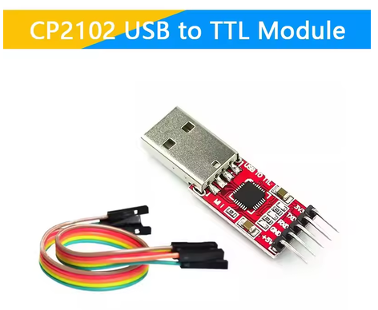

# Zte MF286R (A1 ISP Firmware)
This repo contains Zte MF286R Firmware, specifically from Croatian ISP "A1" 
 

 
 
Software version: CR_A1TKHRMF286RV1.0.0B08 
Hardware version: MF286R-1.0 (this one is without the battery) 
 
This is the latest firmware as of 29.7.2026. 
It was developed somewhere in 2022 judging by the copyright date... 
Me, and many others think that this is the latest one that's going to come out by A1 Croatia 😭 
 

 
## Why have I dumped it?
I wanted to change the firmware, and I noticed that the original firmware, like many other isp's firmware, was not dumped...
 
## Why did I want to change the firmware?
With ~~retarded~~ oversimplified firmware A1 provided, you cant change much settings... 
With OpenWrt firmware you could add much more functionality and settings... 
 
Another huge contributing factor was that A1 can spy and modify your router at any time with TR069 💀 
(it phones home every 3 minutes, 24/7)
 

 
## Dumping process
### Disassembling the router
There are small differences between MF286R routers (each isp customized their one's). 
Some have battery's (like ex Tele2 routers, now Telemach), some have different pcb's... 
 

 
### Soldering UART wires
To communicate with the router, we need a [CP2102 USB to UART adapter](https://www.aliexpress.com/item/1005008880984585.html) (its very cheap, even after eu taxes) 
 
## Thanks!
Huge shout out to guys at [OpenWrt](https://openwrt.org/) for making custom firmware for this bad boy. 
The firmware was extracted using a [guide](https://openwrt.org/toh/zte/mf286r) they made... (Step 1; Method 1, Step 2; Method 2) 
