# Zte MF286R (A1 ISP Firmware) 💻
This repo contains Zte MF286R Firmware, specifically from Croatian ISP "A1"<br>
<br>

<br>
<br>
Software version: CR_A1TKHRMF286RV1.0.0B08<br>
Hardware version: MF286R-1.0 (this one is without the battery)<br>
<br>
This is the latest firmware as of 29.7.2026.<br>
It was developed somewhere in 2022 judging by the copyright date...<br><br>
Me, and many other people on various forums think that this is the latest firmware that's going to come out by A1 Croatia, since they got new routers to offer... 😭<br>
<br>


<br>
## Why have I dumped it? ❔
I wanted to change the firmware, and I noticed that the original firmware, like many other isp's firmware, was not dumped...
<br>
## Why did I want to change the firmware? ❔
With ~~retarded~~ oversimplified firmware A1 provided, you cant change much settings...<br>
With OpenWrt firmware you could add much more functionality and settings...<br>
<br>
Another huge contributing factor was that A1 can spy and modify your router at any time with TR069 💀<br>
(it phones home every 3 minutes, 24/7)
<br>

<br>
## Dumping process ☣️
### Disassembling the router 🪛
There are small differences between MF286R routers (each isp customized their one's).<br>
Some have battery's (like ex Tele2 routers, now Telemach), some have different pcb's...<br>
<br>

<br>
### Soldering UART wires 🧨
To communicate with the router, we need a [CP2102 USB to UART adapter (serial TTL)](https://www.aliexpress.com/item/1005008880984585.html) (its very cheap, even after eu taxes)<br><br>
<br><br>
I had some spare longer wires (you just need 3; TX RX GND), and soldered them using this [refrence](https://openwrt.org/_media/media/zte/mf286d/mf286d-serial-console.jpg)...<br><br>
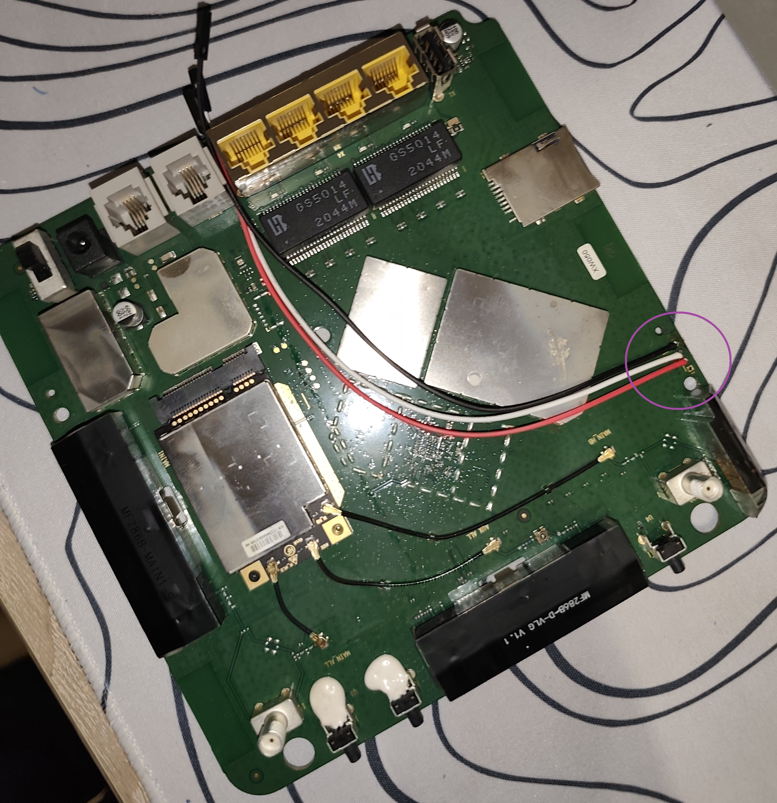<br><br>
After soldering I recommend to hot/super glue it a bit to secure it in place...<br><br>
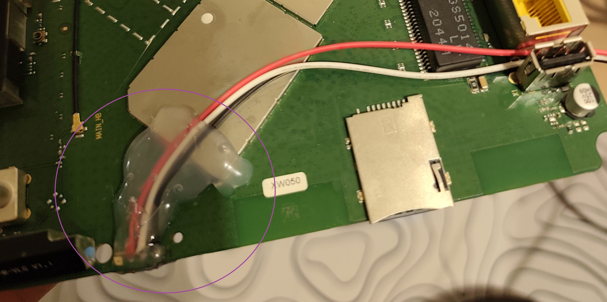<br><br>
I placed my wires through the empty battery pins place on the plastic shell...<br><br>
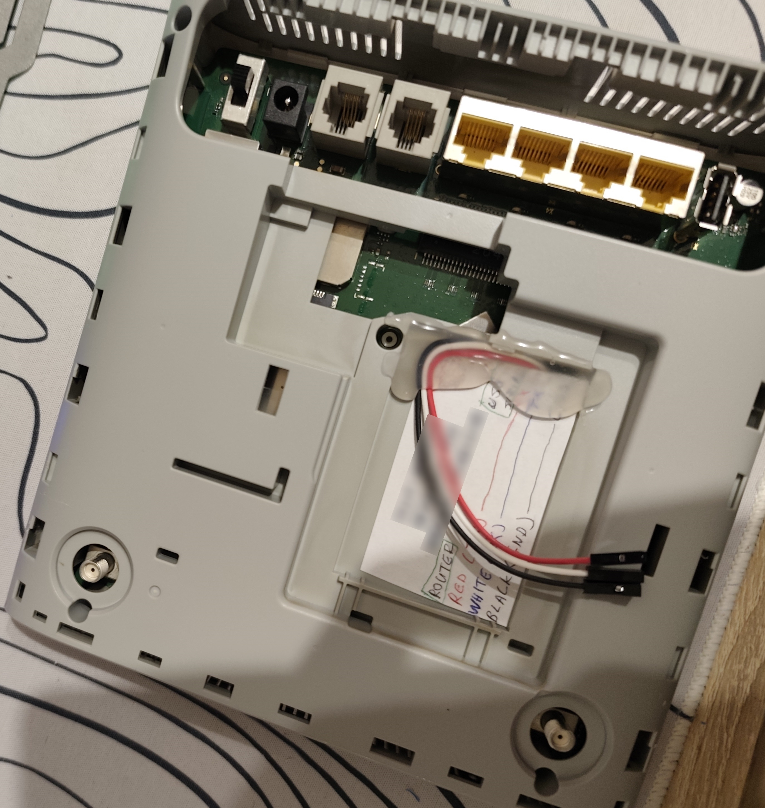<br><br>
Now I got easy access to the UART cables, just pop off one panel 😭<br>
I also recommend to put a small sticker to label your wires...
<br>
### Dumping the firmware 😠
Connect everything (tx on rx, rx on tx, usb to pc...), do not connect the router to power yet!.<br><br>
Install [(those drivers if on windows)](https://www.pololu.com/docs/0j7/all).<br><br>
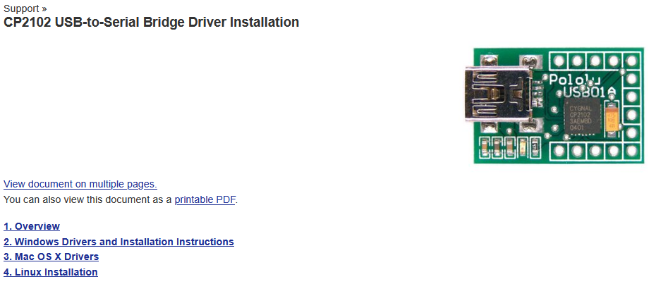<br><br>
Check COM port number for the CP2102 adapter.<br><br>
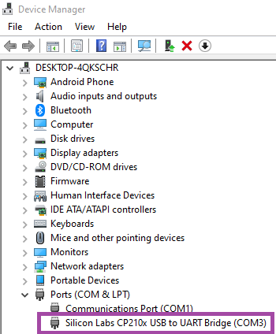<br><br>
Set the connection type to serial. Enter the COM port number into [PuTTY](https://putty.org/index.html), set the bitrate (speed) to 115200, press Open.<br><br>
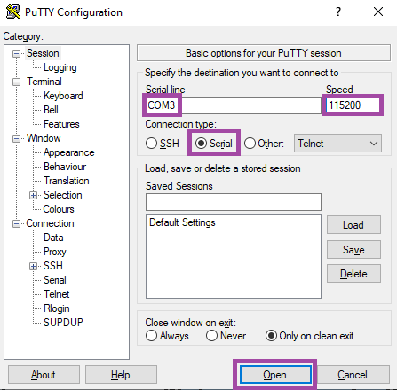<br><br>
Connect a usb flash drive (max 4gb) to your pc, format as FAT. Safely eject and connect to the router!<br><br>
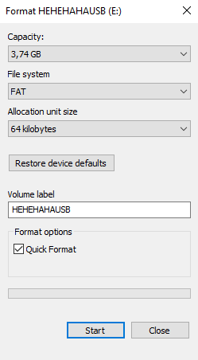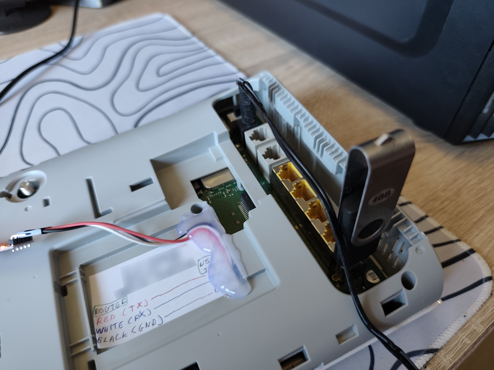<br><br>
Plug the power cable into the router, you will instantly see boot logs. Wait for them to finish appearing. And press enter.<br><br>
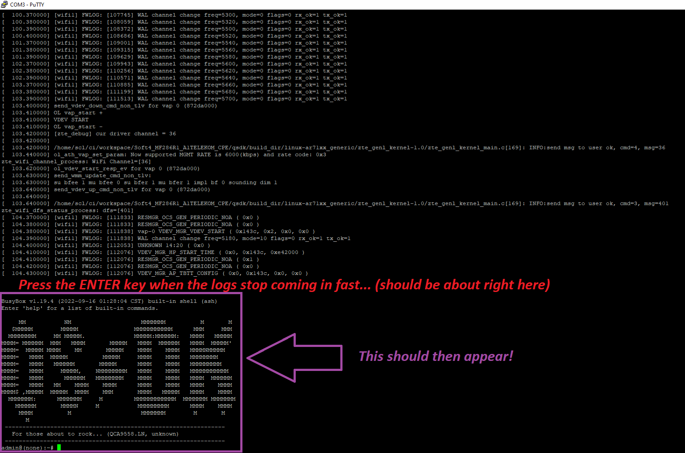<br><br>
Type this command to list the partitions, and press enter:
```
cat /proc/mtd
```
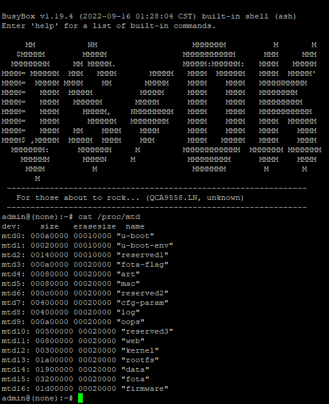<br><br>
Take note of the number of the parititons!!! In my case I have 17 (0-16), adjust this command accordingly!<br>
After checking the command type it in, press enter, it will start copying the partitions to the usb flash drive.<br>
When admin@(none):~# appears back, you know that it finished copying.
```
for i in 0 1 2 3 4 5 6 7 8 9 10 11 12 13 14 15 16; do cat /dev/mtd$i > \
/var/usb_disk/mtd$i; done
```
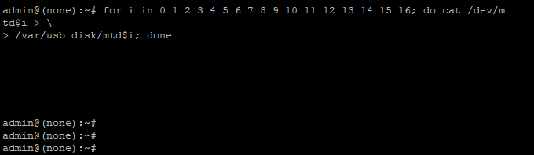<br><br>
Type this command to safely remove the usb flash drive from the router:
```
umount /var/usb_disk; sync
```
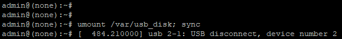<br><br>
Nice, now you got all of your partitons (firmware) saved up!<br>
Copy it over somewhere safe! And archive it like me. 😅><br><br>
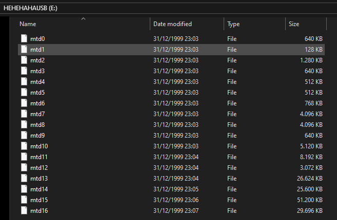
<br>
## Where can I download the firmware, and see the boot logs? ❔
Check the release section on this repo, or follow this [link](https://github.com/TheLocalFemboyy/Zte_MF286R-A1_Isp_Firmware/releases/tag/Firmware).
## Thanks! 💌
Huge shout out to guys at [OpenWrt](https://openwrt.org/) for making custom firmware for this router.<br>
The firmware was extracted using specific steps from their [guide](https://openwrt.org/toh/zte/mf286r). (Step 1; Method 1, Step 2; Method 2)<br>
